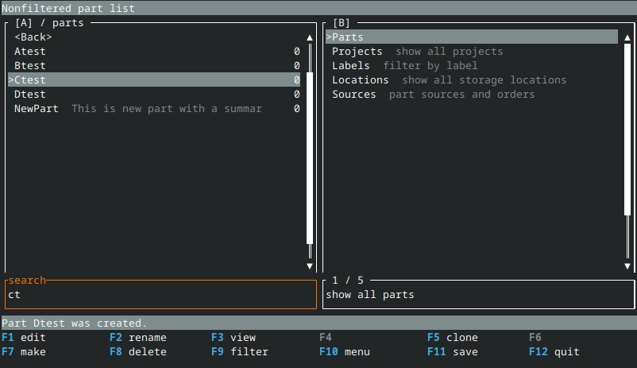

= diiLo: Dual panel inventory manager
:icons: font

This project implements an inventory manager in the dual panel flavor known from old and loved file managers. It requires nothing more than a text console and stores data in plain text files.

It allows an efficient tracking of stock movement between locations, sources and projects.

CAUTION: *This project is not production ready, use at your own risk and backup regularly*

== Goals

Here are the cornerstones of the project that should be used when in doubt about a feature or implementation.

* Human readable and editable data storage format
** both the raw storage itself,
** and the semantics, minimize typing and complex string and id related relationships
* Keyboard friendly navigation

== Why diiLo

* dílo in Czech means work, accomplishment
* it is an ASCII art - a warehouse forklift
* it is easy to type on a qwerty keyboard, most of the letters are clustered together

== Data storage

The data is stored according to the https://specifications.freedesktop.org/basedir-spec/latest/[FreeDesktop's XDG Base Directory specification].

Data go to `$HOME/.local/share/diilo/` directory. Internally there are two sub-directories - `md` for definition files and `ledger` for tracking movements and deliveries.

== Screenshots

The pictures are from various stages of development and might not be fully accurate wrt the current version.

.Main screen


.Create dialog


.Display details


.External edit


.Label using dual panel view


.Create part in location with autocomplete


.Quickly search by typing


.Request amount of parts to be required in location


== Building

This project is developed using the https://www.rust-lang.org/[Rust] language. The UI is done using the https://ratatui.rs/[ratatui crate].

All you need to do is install the https://www.rust-lang.org/tools/install[rust toolchain] (https://rustup.rs/[rustup] is recommended) and cargo.

Then simply type:

```
$ cargo run
```

== Debugging issues

The program writes a detailed log to a cache directory that is by default located in `$HOME/.cache/mspart/mspart.log`

The verbosity is set to `INFO` by default and can be controlled by environment variables. See https://docs.rs/env_logger/latest/env_logger/#enabling-logging for details of how to control the levels and filters.

When a crash occurs, it is useful to reproduce it with the Rust's `RUST_BACKTRACE=1` environment variable set. This provides detailed information about where the issue happened.

In case a crash corrupts the terminal behavior (no characters printed, weird colors, etc.), type `reset` to the terminal and press `<Enter>`.

== License

diiLo - dual panel inventory manager
Copyright (C) 2024  Martin Sivak

This program is free software: you can redistribute it and/or modify
it under the terms of the GNU Affero General Public License as
published by the Free Software Foundation, either version 3 of the
License, or (at your option) any later version.

This program is distributed in the hope that it will be useful,
but WITHOUT ANY WARRANTY; without even the implied warranty of
MERCHANTABILITY or FITNESS FOR A PARTICULAR PURPOSE.  See the
GNU Affero General Public License for more details.

You should have received a copy of the GNU Affero General Public License
along with this program.  If not, see <https://www.gnu.org/licenses/>.
